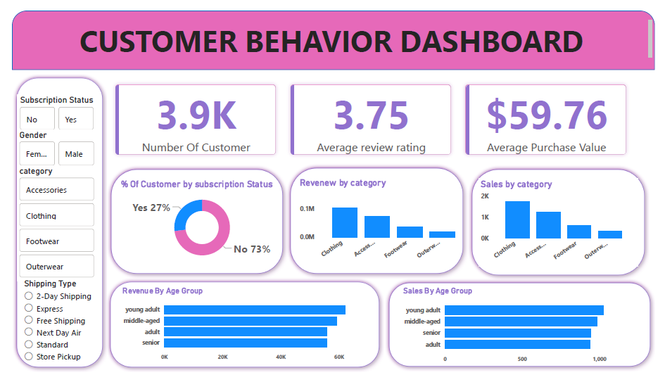

# Customer Shopping Behaviour Analysis
### Project Report | Sachin Shinde | B.E. AI & Data Science | ACPCE, University of Mumbai | May 2026

---

## 1. Project Overview

This project presents a complete end-to-end data analytics pipeline built on a retail customer behaviour dataset. The objective was to clean raw transactional data, load it into a relational database, answer structured business questions using SQL, and present actionable insights through an interactive Power BI dashboard.

**Tech Stack:** Python (pandas) · MySQL · Power BI · Jupyter Notebook · GitHub

**GitHub:** [github.com/Sachin5601/customer-shopping-behaviour-analysis](https://github.com/Sachin5601/customer-shopping-behaviour-analysis)

---

## 2. Dataset Summary

| Attribute | Detail |
|-----------|--------|
| Total Records | 3,900 transactions |
| Total Features | 18 columns |
| Missing Values | 37 nulls in Review Rating column |
| Demographics | Age, Gender, Location, Subscription Status |
| Purchase Details | Item Purchased, Category, Purchase Amount, Season, Size, Color |
| Behaviour Signals | Discount Applied, Promo Code Used, Previous Purchases, Frequency of Purchases, Review Rating, Shipping Type |

---

## 3. Data Cleaning & Preparation (Python + pandas)

All data cleaning was performed in Python using pandas inside a Jupyter Notebook. The following steps were executed:

**3.1 Initial Exploration**
- Loaded dataset using `pd.read_csv()`
- Used `df.info()` to inspect dtypes and null counts
- Used `df.describe()` to understand statistical distribution of numerical columns

**3.2 Missing Value Treatment**
- Identified 37 missing values in the `review_rating` column
- Imputed missing values using **category-wise median** — a more robust strategy than global mean, as product ratings vary significantly by category

**3.3 Column Standardization**
- Renamed all columns to `snake_case` using `df.columns.str.lower().str.replace(' ', '_')`
- Ensures consistency when writing SQL queries in MySQL

**3.4 Feature Engineering**
- Created `age_group` column by binning customer ages into four groups: Young Adult, Adult, Middle-aged, Senior
- Created `purchase_frequency_days` derived feature from purchase frequency data

**3.5 Data Consistency Check**
- Verified that `discount_applied` and `promo_code_used` were highly correlated and redundant
- Dropped `promo_code_used` to reduce dimensionality

**3.6 Database Integration**
- Connected Python script to MySQL using SQLAlchemy
- Loaded the cleaned DataFrame into MySQL table `customer` inside database `customer_behavior`

---

## 4. SQL Business Analysis (MySQL)

Ten structured business questions were answered using MySQL queries. Advanced SQL concepts used include **CTEs (WITH clause)**, **window functions (ROW_NUMBER, RANK)**, **subqueries**, and **CASE statements**.

---

**Q1. Total Revenue by Gender**
```sql
SELECT gender, SUM(purchase_amount) AS revenue 
FROM customer GROUP BY gender;
```
| Gender | Revenue |
|--------|---------|
| Male | $157,890 |
| Female | $75,191 |

> **Insight:** Male customers contribute 2.1x more revenue than female customers. Marketing budget allocation should reflect this split.

---

**Q2. High-Spending Discount Users**
```sql
SELECT customer_id, purchase_amount FROM customer
WHERE discount_applied='yes' 
AND purchase_amount >= (SELECT AVG(purchase_amount) FROM customer);
```
> **Insight:** 839 customers used discounts yet still spent above the average ($59.76). These are high-value discount users — ideal targets for premium loyalty programs.

---

**Q3. Top 5 Products by Average Review Rating**
```sql
SELECT item_purchased, ROUND(AVG(review_rating),2) AS Average_Product_Rating
FROM customer GROUP BY item_purchased
ORDER BY AVG(review_rating) DESC LIMIT 5;
```
| Product | Avg Rating |
|---------|-----------|
| Gloves | 3.86 |
| Sandals | 3.84 |
| Boots | 3.82 |
| Hat | 3.80 |
| Skirt | 3.78 |

---

**Q4. Shipping Type Comparison**
```sql
SELECT shipping_type, ROUND(AVG(purchase_amount),2) 
FROM customer WHERE shipping_type IN ('Standard','Express')
GROUP BY shipping_type;
```
| Shipping Type | Avg Purchase |
|---------------|-------------|
| Standard | $58.46 |
| Express | $60.48 |

> **Insight:** Express shipping customers spend slightly more — suggesting a higher-spending customer profile willing to pay for speed.

---

**Q5. Subscriber vs Non-Subscriber Spend**
```sql
SELECT subscription_status, COUNT(customer_id) AS total_customer,
ROUND(AVG(purchase_amount),2) AS avg_spend,
SUM(purchase_amount) AS total_revenue
FROM customer GROUP BY subscription_status ORDER BY total_revenue, avg_spend DESC;
```
| Status | Customers | Avg Spend | Total Revenue |
|--------|-----------|-----------|---------------|
| Yes | 1,053 | $59.49 | $62,645 |
| No | 2,847 | $59.87 | $170,436 |

> **Insight:** 73% of customers are non-subscribers generating 73% of revenue — the subscription conversion opportunity is massive.

---

**Q6. Most Discount-Dependent Products**
```sql
SELECT item_purchased,
ROUND(100.0 * SUM(CASE WHEN discount_applied = 'Yes' THEN 1 ELSE 0 END)/COUNT(*),2) AS discount_rate
FROM customer GROUP BY item_purchased ORDER BY discount_rate DESC LIMIT 5;
```
| Product | Discount Rate |
|---------|--------------|
| Hat | 50.00% |
| Sneakers | 49.66% |
| Coat | 49.07% |
| Sweater | 48.17% |
| Pants | 47.37% |

---

**Q7. Customer Segmentation using CTE**
```sql
WITH customer_type AS (
  SELECT customer_id, previous_purchases,
  CASE WHEN previous_purchases = 1 THEN 'New'
       WHEN previous_purchases BETWEEN 2 AND 10 THEN 'Returning'
       ELSE 'Loyal' END AS customer_segment
  FROM customer)
SELECT customer_segment, COUNT(*) AS "Number of Customers"
FROM customer_type GROUP BY customer_segment;
```
| Segment | Count |
|---------|-------|
| Loyal | 3,116 |
| Returning | 701 |
| New | 83 |

> **Insight:** 80% of customers are Loyal — a strong retention base. Focus on converting Returning customers into Loyal ones.

---

**Q8. Top 3 Products per Category (Window Function)**
```sql
WITH item_counts AS (
  SELECT category, item_purchased, COUNT(customer_id) AS total_orders,
  ROW_NUMBER() OVER (PARTITION BY category ORDER BY COUNT(customer_id) DESC) AS item_rank
  FROM customer GROUP BY category, item_purchased)
SELECT item_rank, category, item_purchased, total_orders
FROM item_counts WHERE item_rank <= 3;
```
> **Insight:** Jewelry, Blouse, and Sandals lead in their respective categories — useful for inventory and promotion planning.

---

**Q9. Repeat Buyers and Subscription Correlation**
```sql
SELECT subscription_status, COUNT(customer_id) AS repeat_buyers
FROM customer WHERE previous_purchases > 5 GROUP BY subscription_status;
```
| Subscription | Repeat Buyers |
|-------------|--------------|
| No | 2,518 |
| Yes | 958 |

> **Insight:** 2,518 repeat buyers (>5 purchases) are NOT subscribed. These are the highest-priority subscription conversion targets.

---

**Q10. Revenue by Age Group**
```sql
SELECT age_group, SUM(purchase_amount) AS revenue
FROM customer GROUP BY age_group ORDER BY revenue DESC;
```
| Age Group | Revenue |
|-----------|---------|
| Young Adult | $62,143 |
| Middle-aged | $59,197 |
| Adult | $55,978 |
| Senior | $55,763 |

---

## 5. Power BI Dashboard



An interactive dashboard was built in Power BI Desktop with the following components:

**KPI Cards:** Total Customers (3.9K) · Average Purchase Amount ($59.76) · Average Review Rating (3.75)

**Visuals:**
- Donut chart — % of customers by subscription status
- Bar chart — Revenue by category
- Bar chart — Sales by category
- Horizontal bar — Revenue by age group
- Horizontal bar — Sales by age group

**Slicers (Dynamic Filters):**
- Subscription Status (Yes / No)
- Gender (Male / Female)
- Category (Accessories / Clothing / Footwear / Outerwear)
- Shipping Type (6 types)

---

## 6. Business Recommendations

| # | Recommendation | Based On |
|---|---------------|----------|
| 1 | **Boost subscription conversion** — launch exclusive subscriber benefits campaign targeting 2,518 repeat non-subscribers | Q5, Q9 |
| 2 | **Reward loyal customers** — introduce tiered loyalty program to prevent churn among 3,116 loyal customers | Q7 |
| 3 | **Review discount policy** — Hat, Sneakers, Coat over-rely on discounts (47–50%); assess margin impact | Q6 |
| 4 | **Target Young Adults** — highest revenue segment at $62,143; prioritize in seasonal campaigns | Q10 |
| 5 | **Promote top-rated products** — Gloves, Sandals, Boots have highest satisfaction; feature in marketing | Q3 |

---

## 7. Project Structure

```
customer-shopping-behaviour-analysis/
├── customer_shopping_behavior.csv
├── customer_shopping_behavior.ipynb
├── customer_shopping_behavior.sql
├── Customer_Behavior_Dashboard.pbix
├── dashboard_screenshot.png
└── README.md
```

---

## 8. Author

**Sachin Shinde**
B.E. Artificial Intelligence & Data Science | ACPCE, University of Mumbai | Graduating May 2026

- 📧 eng.sachinshinde@gmail.com
- 🐙 [github.com/Sachin5601](https://github.com/Sachin5601)
- 💼 [linkedin.com/in/sachin5601](https://linkedin.com/in/sachin5601)
